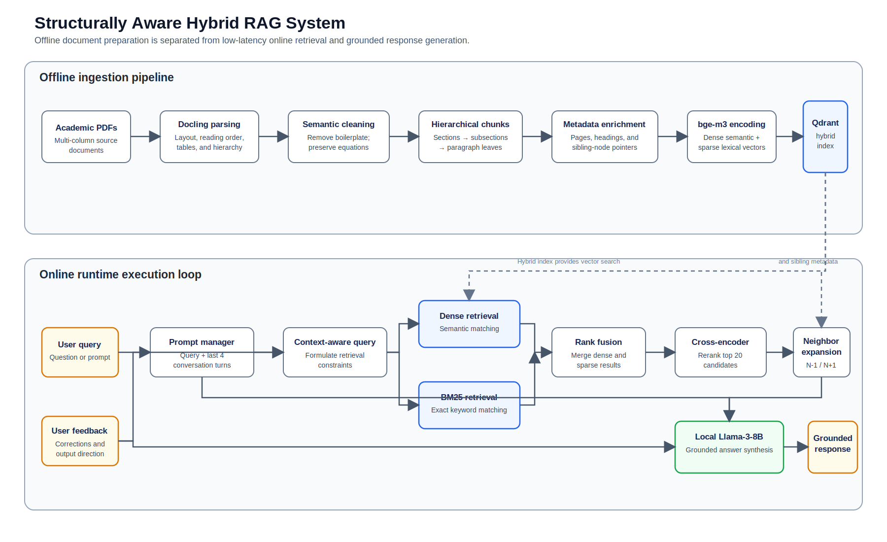

# Engineering a Structurally Aware Hybrid RAG System for Academic Literature

## 1. Executive Summary & Problem Statement
Traditional Retrieval-Augmented Generation (RAG) applications treat documents as flat strings of plain text, which introduces significant points of failure when applied to dense academic literature. Highly technical publications—such as foundational deep learning papers covering Transformer architectures, BERT, RoBERTa, GPT-3, and T5—rely on specific spatial and semantic structures to convey meaning. These complex features include:
* Multi-column text layouts that dictate reading sequence.
* Intricate hierarchical structures (Title -> Sections -> Subsections -> Paragraphs).
* Embedded data representations such as tables, figures, charts, and corresponding descriptive captions.
* Complex inline and block mathematical notations or mathematical equations.
* Dense networks of internal cross-references and bibliographic citations.

Standard layout-agnostic parsing tools systematically scramble two-column paragraphs, read text directly across margins, strip out critical section boundaries, and break continuous logical arguments apart based on arbitrary character limits. The resulting data fragmentation drops retrieval recall, introduces structural noise into vector spaces, and causes significant downstream LLM hallucinations.

To solve these limitations, this project establishes a production-grade, structurally aware, open-source RAG architecture designed to ingest, index, and query specialized academic texts. The application maps documents into hierarchical structural trees rather than character buffers. The runtime pipeline maintains an active conversation history window tracking exactly the last 4 turns, handles real-time corrective user feedback, and quantifies execution quality using an automated RAGAS evaluation engine against a test suite of 10 complex analytical questions.

---

## 2. System Architecture & High-Level Design
The architecture decouples data preparation from runtime execution to isolate heavy computation. It is explicitly separated into an Offline Ingestion Pipeline and an Online Runtime Execution Loop.

### Architecture Diagram & Logical Data Flow

The offline pipeline builds a structure-aware hybrid index once per document set. The online loop uses that index for hybrid retrieval, reranking, neighbor expansion, and grounded answer generation.

---

## 3. Detailed Component Blueprint & Tool Selection Rationale

### A. Document Layout Parsing
* **Selected Tool:** Docling
* **Rationale & Strategy:** Traditional text extractors strip spatial orientation, processing text horizontally across columns and rendering scientific layouts illegible. Docling is selected because it preserves document layout and structure by treating the file as an integrated document object model. It recognizes section hierarchies, reading orders, tabular structural grids, and bounded figure objects, keeping multi-column sentences readable and properly sequenced.

### B. Structural Text Cleaning & Preprocessing
* **Selected Tools:** Docling Document Model + BeautifulSoup + Python Re (Regex)
* **Rationale & Strategy:** Technical documents contain pervasive textual noise (e.g., repeating running page headers, publication footnotes, conference banners, and page indexes) that clutters and pollutes embedding spaces. This processing layer strips boilerplate text while keeping critical structural elements intact, including: inline/block mathematical notation, figure descriptions, table boundaries, section IDs, and references.

### C. Hierarchical Semantic Chunking
* **Selected Tool:** LlamaIndex HierarchicalNodeParser
* **Rationale & Strategy:** Character-count splitting breaks up complex logical arguments in academic papers, scattering evidence across boundaries. A hierarchical parser splits content along natural document boundaries (Sections -> Subsections -> Paragraphs -> Leaves).
* **Configuration Execution:** System targets a leaf structural dimension of 700–1200 tokens with a calculated structural window overlap of 100–150 tokens to ensure continuity across technical sub-arguments.

### D. Multi-Modal Embedding Generation
* **Selected Model:** BAAI/bge-m3
* **Rationale & Strategy:** Technical text requires robust vector representations. The bge-m3 model natively supports dense semantic vector formatting, sparse token lexical weights, and multi-vector tracking within an open-source framework. It delivers excellent performance on specialized language, mathematical symbols, and technical idioms found in machine learning publications.

### E. Database Layer & Vector Storage
* **Selected Tool:** Qdrant
* **Rationale & Strategy:** Qdrant is selected over simpler memory maps because it provides an integrated, production-ready storage architecture for hybrid search profiles. It manages multi-vector indexing, handles extensive payload metadata parsing, and applies real-time attribute filters without requiring separate standalone systems for keyword and vector lookups.

### F. Multi-Tier Hybrid Retrieval Engine
* **Selected Strategy:** Unified Dense Semantic Vectors + BM25 Sparse Keyword Tokenization
* **Rationale & Strategy:** Semantic vectors can overlook exact matches for highly specific, out-of-distribution academic acronyms or unique operational terms (e.g., LayerNorm, BLEU, NSP, SQuAD, RoBERTa) if they appear near similar sentence shapes. Combining dense semantic tracking with precise BM25 keyword mapping improves retrieval accuracy by surface-matching specific technical terminology alongside conceptual concepts.

### G. Cross-Encoder Reranking
* **Selected Model:** BAAI/bge-reranker-v2-m3
* **Rationale & Strategy:** Standard vector search scores queries and document chunks independently, which can lose key technical context over long spans. A cross-encoder reranker runs joint attention checks across the combined query-chunk text space. Processing the top 20 candidate text segments through this layer filters out false positives and groups the most accurate hits at the top of the context pile.

### H. Neighbor Context Assembly Engine
* **Selected Protocol:** Structural Node Expansion
* **Rationale & Strategy:** Even an accurate paragraph match can lose its surrounding context if it relies on upstream variable definitions or downstream summary points. When a specific leaf node returns a high-confidence match, the assembly engine uses its metadata map to retrieve its adjacent chronological siblings (e.g., bringing in Node N-1 and Node N+1 for Target Node N), creating a coherent block of text for the generation stage.

### I. Large Language Model Integration
* **Selected Engine:** Local Inference Hub (Ollama or Hugging Face Transformers) orchestrating Llama-3-8B-Instruct.
* **Rationale & Strategy:** Local instruction-tuned models provide predictable performance and strict prompt compliance without external API dependencies. Running a localized instance ensures zero latency drift, complete data privacy, and predictable runtime behavior across batch workloads.

### J. Automated Evaluation Framework
* **Selected Framework:** RAGAS
* **Rationale & Strategy:** Manual grading of RAG answers does not scale. RAGAS automates this process by using LLM-assisted evaluation across three core metrics: Faithfulness (checking that answers are strictly grounded in the text), Answer Relevance (verifying the prompt was directly addressed), and Context Recall (measuring the retrieval engine's success in finding relevant data chunks).

---

## 4. Implementation Details & Strategic Workflows

### Advanced Metadata Enrichment Matrix
Before chunks are stored in the vector database, they are tagged with a detailed metadata schema. This relational metadata powers exact runtime filtering and coordinates the neighboring node expansion logic.

[Advanced Metadata Enrichment Matrix JSON Snippet will go here]

### Neighbor Context Expansion Algorithm
When the retrieval engine returns the high-scoring text chunks from a query, the system runs this structural expansion workflow to rebuild context continuity:
1. Isolate the top candidate leaf node keys based on the unified hybrid reranking scores.
2. Parse the metadata payload to identify the associated previous_sibling_id and next_sibling_id attributes.
3. Batch-query the database to pull those neighboring structural text chunks.
4. Reassemble the retrieved segments into true chronological order based on their chunk_id_sequence.
5. Format the combined text blocks with explicit document headers (e.g., --- Document: BERT | Section: 2.3 | Page 4 ---) before passing the text to the LLM generation context window.

---

## 5. Operational Prompt Topology & Memory Management

### Conversational State Tracking Interface
To maintain an active memory window tracking exactly the last 4 interactions, the runtime architecture wraps traffic inside a strict First-In, First-Out (FIFO) conversation state buffer.

[Conversational State Tracking Interface Text Snippet will go here]

### Production Prompt Topology Template
The prompt template explicitly segregates instructions, historical turns, real-time feedback corrections, and retrieved source material to prevent text overlap:

[Production Prompt Topology Template Text Snippet will go here]

---

## 6. Experimental Ledger & Implementation Challenges
This ledger is an open logging section used to track implementation issues, vector collision rates, parsing anomalies, and evaluation metrics during system testing and tuning.

| Date | Experiment Run | Target Metric | Encountered Defect / Observation | Mitigation Strategy Applied |
| :--- | :--- | :--- | :--- | :--- |
| Pending | Run #01: Pure Dense Lookup | RAGAS Context Recall | Dense embeddings missed exact structural keywords in multi-column tables. | Introduced BM25 hybrid indexing search tier. |
| Pending | Run #02: Unstructured Flattening | RAGAS Faithfulness | Scrambled paragraph segments caused hallucinations during generation. | Replaced standard loader with Docling spatial parser. |
| Pending | Run #03: Quantized Inference | Latency vs. Perplexity | Base model exceeded normal parameter execution limits during active generation. | Configured fixed 4-bit quantization mappings with locked thread processing allocations. |
| Pending | Run #04: Feedback Injection | Adherence Accuracy | Memory context drift bypassed late-stage prompt assertions. | Restructured the prompt topology to isolate user correction fields directly above the reference material context blocks. |
